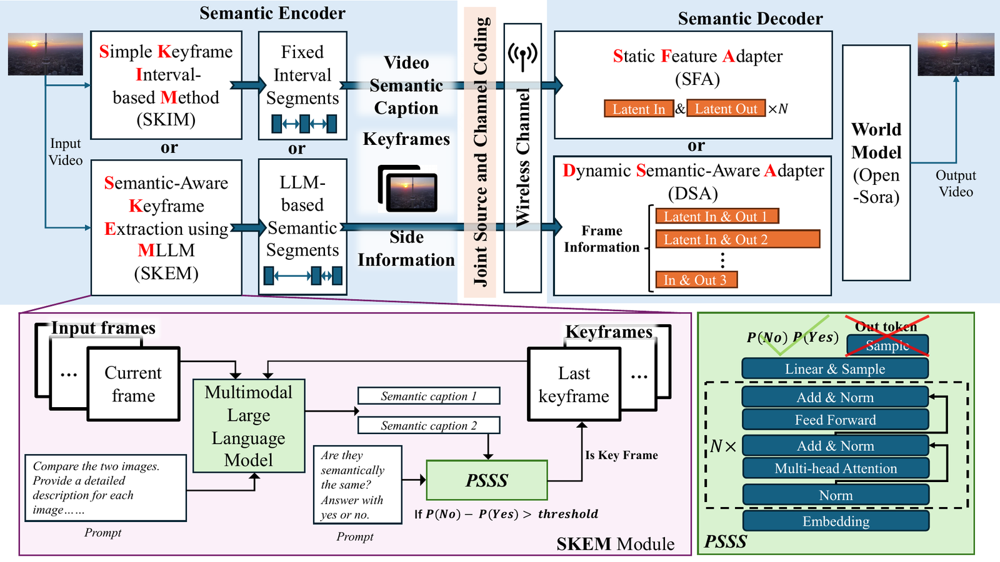
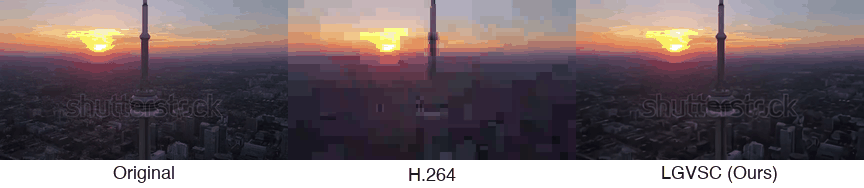
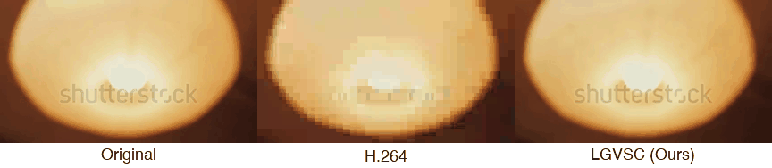
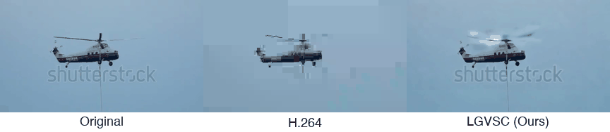
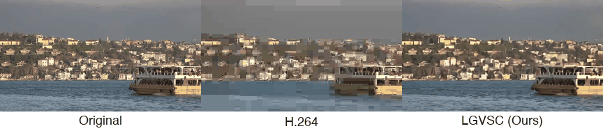
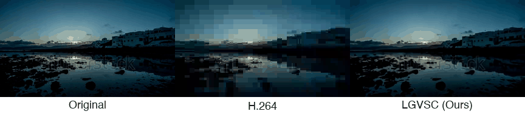
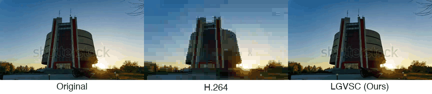
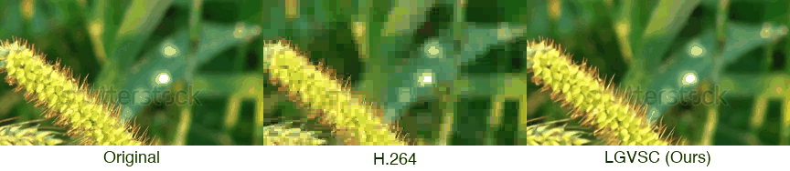
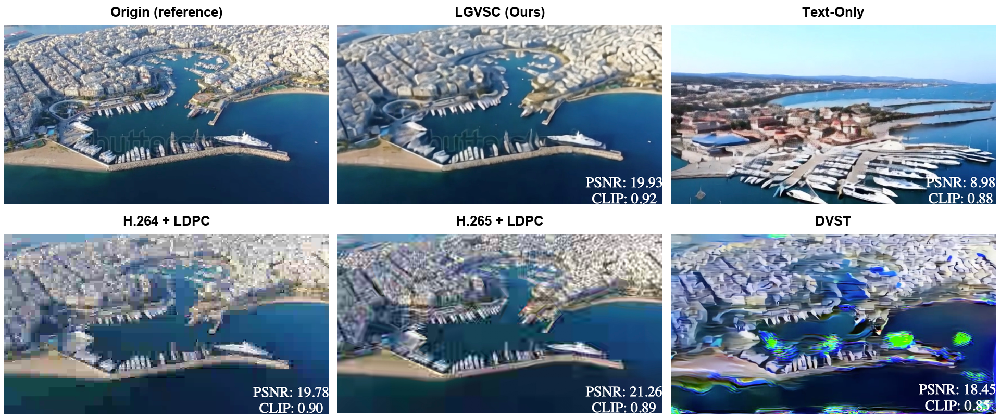
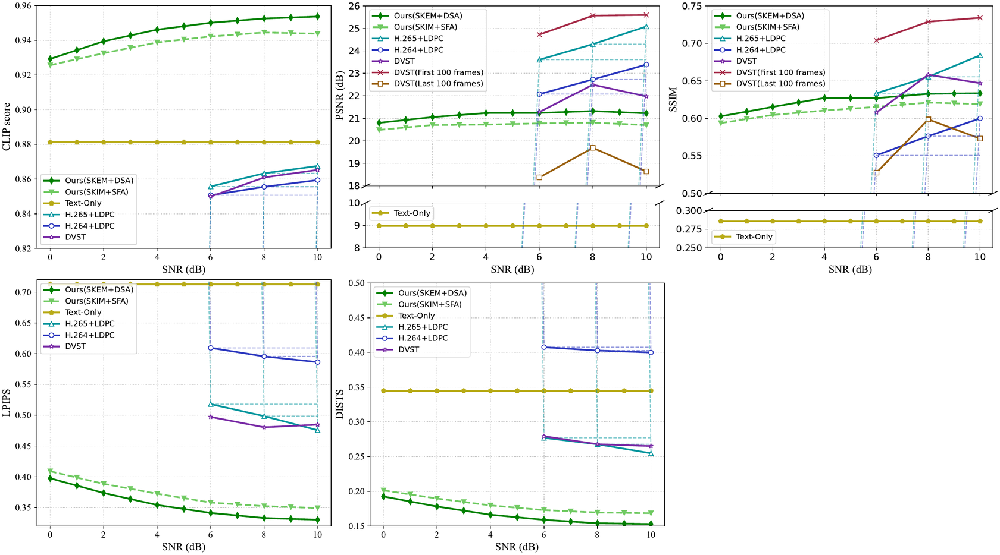

# LGVSC: A Large-Model-Driven Generative Video Semantic Communication Framework

[](LICENSE)
[](https://github.com/TT2TER/LGVSC/actions/workflows/ci.yml)

**本论文已被 IEEE Transactions on Vehicular Technology 接收。**
**This paper has been accepted by IEEE Transactions on Vehicular Technology.**
[[arXiv 2606.12899]](https://arxiv.org/abs/2606.12899)

Official code release for the paper
**"LGVSC: A Large-Model-Driven Generative Video Semantic Communication Framework."**

LGVSC transmits video over wireless channels at an extremely low channel bandwidth
ratio (CBR, on the order of `1e-4` ~ `1e-3`) by replacing pixel-level transmission
with **explicit, interpretable semantic representations** that are regenerated by a
generative world model at the receiver.



> The transmitter selects keyframes (SKIM or SKEM+PSSS) and encodes each segment into
> explicit semantics — caption `I_text` (multimodal LLM), keyframe `I_frame` (NTSCC/JSCC),
> and optical-flow side info `I_side` (LDPC). The receiver regenerates each variable-length
> segment with the Open-Sora world model + adapter (SFA or DSA) and concatenates them.

The two operating points reported in the paper:

| Configuration | Keyframe selection | Decoder adapter | Target scenario |
|---|---|---|---|
| **SKIM + SFA** | fixed interval | static (fixed segment length) | low latency / low compute |
| **SKEM + DSA** | semantic-guided (PSSS) | dynamic (variable segment length) | higher semantic fidelity |

---

## Results

### Video comparisons

Each animation shows **Original | H.264+LDPC | LGVSC (Ours)** side by side at SNR = 10 dB.
LGVSC operates at roughly half the CBR of H.264+LDPC and one-sixth of DVST.









### Static frame comparison

The same frame reconstructed by each scheme at SNR = 10 dB. LGVSC stays
visually faithful to the reference while operating at a CBR three to four orders of magnitude
below the conventional codec baselines:



### Quantitative metrics

Semantic and perceptual quality vs. channel SNR (CLIP↑ / PSNR↑ / SSIM↑ / LPIPS↓ / DISTS↓):



> Figures are taken from the paper; the per-metric plotting scripts live in `06_evaluation/`.

---

## Repository layout

The repo is organized by **pipeline stage**. Each stage has its own `README.md`
with exact commands, inputs/outputs, and the conda environment to use.

```
LGVSC/
├── env.sh                    # central path configuration (edit this first)
├── environment/              # conda environment specs (one per stage) + notes
├── docs/
│   ├── pipeline.md           # architecture & data-flow walkthrough
│   ├── CODE_WALKTHROUGH.md   # every script/function/param in data-flow order
│   ├── DATA.md               # data sources (WebVid/Kinetics/OpenImages) + bundled sample
│   ├── SMOKE_TEST.md         # end-to-end run on the bundled sample + observed outputs
│   └── REPRODUCIBILITY.md    # determinism characterization (env-sensitive keyframes, robust aggregates)
│
├── 01_data_prep/             # normalize videos (576x320, 24fps, <=16s) + extract frames
├── 02_semantic_encoder/      # TRANSMITTER
│   ├── skim/                 #   fixed-interval keyframe selection
│   ├── skem/                 #   PSSS-guided keyframe selection (InternVL2)
│   └── caption/              #   I_text (PLLaVA) + I_side optical flow (UniMatch) driver
├── 03_jscc_transmission/
│   ├── ntscc/                #   keyframe transmission via NTSCC (+ patch, weights)
│   └── ldpc_sionna/          #   text/side-info transmission via LDPC (Sionna)
├── 04_semantic_decoder/      # RECEIVER: Open-Sora world model + SFA/DSA scripts
├── 05_baselines/             # H.264 / H.265 + LDPC  (DVST baseline not included; see below)
├── 06_evaluation/            # CLIP / PSNR / SSIM / LPIPS / DISTS + plotting + complexity
└── 07_downstream/            # zero-shot downstream: action recognition / depth / captioning
```

> **Conventions used throughout**
> - **Method name** encodes keyframe scheme + SNR, e.g. `key_framesinternvl_diff_0.35_10`
>   = InternVL SKEM keyframes at semantic-divergence threshold `0.35`, transmitted at SNR `10` dB.
> - **CSV interfaces** chain the stages: `<method>_video_paths.csv` →
>   `<method>_video_paths_text.csv` → `<method>_video_paths_text_flow.csv`.
> - Stages run in **different conda environments** (see table below). This is inherent
>   to the pipeline — each large model has incompatible dependencies.

---

## External dependencies (forked, not vendored)

To keep this release small and license-clean, the large upstream models are **not**
copied into this repo. Instead we pin the upstream version and ship only our custom
scripts (and a `.patch` where we modified upstream files).

| Component | Upstream | Pinned version | Our changes |
|---|---|---|---|
| InternVL (SKEM/PSSS) | [OpenGVLab/InternVL](https://github.com/OpenGVLab/InternVL) | commit `a20b7301` · InternVL2-8B weights | new scripts only — **no library patch** |
| PLLaVA (captioning) | [magic-research/PLLaVA](https://github.com/magic-research/PLLaVA) | `pllava-7b` | invoked as-is (driver in `02_semantic_encoder/caption`) |
| NTSCC (keyframe JSCC) | [wsxtyrdd/NTSCC_JSAC22](https://github.com/wsxtyrdd/NTSCC_JSAC22) | commit `411d3933` | `patches/ntscc_modifications.patch` + `main_save.py` |
| Sionna (LDPC) | [NVlabs/sionna](https://github.com/NVlabs/sionna) | `0.19.2` | no patch — see `ldpc_sionna/` |
| Open-Sora (decoder) | [hpcaitech/Open-Sora](https://github.com/hpcaitech/Open-Sora) | commit `bf4d6673` (v1.2) | scripts only — **no library patch** |
| UniMatch (optical flow) | bundled in Open-Sora `tools/scoring/optical_flow` | — | used as-is |
| TimeSformer (action rec.) | [facebookresearch/TimeSformer](https://github.com/facebookresearch/TimeSformer) | commit `a5ef29a7` | `patches/timesformer_modifications.patch` |
| Depth-Anything-V2 (depth) | [DepthAnything/Depth-Anything-V2](https://github.com/DepthAnything/Depth-Anything-V2) | commit `e5a2732d` | `score.py` only — no library patch |

> **DVST baseline** (reported in the paper) was produced with a collaborator's code and is
> intentionally **not** part of this release, nor do we redistribute it. To reproduce it,
> please request the implementation from the **original DVST authors** — Wang et al.,
> "Wireless Deep Video Semantic Transmission," *IEEE JSAC* 2023
> ([paper](https://arxiv.org/abs/2205.13129)). In our experiments we used `eta=0.2`,
> `lambda=128`.

---

## Conda environments

| Stage | Environment | Spec | Machine in our setup |
|---|---|---|---|
| 01 data prep, captioning helpers, eval | `llava` | `environment/llava.yml` | 4090 |
| 02 SKEM / PSSS keyframes | `internvl` | `environment/internvl.yml` | 4090 |
| 02 captioning (PLLaVA) | `pllava` | `environment/pllava.yml` | 4090 |
| 03 NTSCC keyframe transmission | `ntscc` | `environment/ntscc.yml` | 4090 |
| 04 Open-Sora decoder (world model) | `opensora` | `environment/opensora.yml` | **GPU server** |
| 07 action recognition | `timesformer` | `environment/timesformer.yml` | 4090 |
| 07 depth estimation | `depth` | `environment/depth.yml` | 4090 |
| 07 video captioning eval | `video_summary` | `environment/video_summary.yml` | 4090 |

Create any environment with:

```bash
conda env create -f environment/<name>.yml
```

See `environment/README.md` for notes (mirrors, CUDA versions, the 240GB+ checkpoints).

---

## End-to-end reproduction (SKEM + DSA, the main scheme)

> Set your paths once in `env.sh`, then `source env.sh`. `$DATA_ROOT` is a directory
> containing your raw `.mp4` videos. We used 55 WebVid clips for the main results and
> 14 Kinetics-400 clips for action recognition.

```bash
source env.sh                       # exports DATA_ROOT, OPENSORA_DIR, INTERNVL_DIR, ...
REPO="$(pwd)"                       # repo root — every stage below starts from here

# ── Stage 01: data preparation (env: llava) ──────────────────────────────
cd "$REPO/01_data_prep"
./get_prepare.sh "$DATA_ROOT" 16x24            # 24fps, <=16s, 576x320, frames/

# ── Stage 02a: keyframe selection — SKEM (env: internvl) ─────────────────
#   InternVL's `internvl_chat` package must be importable, so put the InternVL
#   repo on PYTHONPATH (running from its dir is NOT enough for an abs script path):
export PYTHONPATH="$INTERNVL_DIR:$PYTHONPATH"
cd "$REPO"
#   --method: code prepends "key_frames" -> folder key_framesinternvl_diff_0.35
#   --threshold: PSSS divergence eta_th (keep consistent with the 0.35 in --method)
python 02_semantic_encoder/skem/MLM-keyframe-internvl.py \
    --csv-path "$DATA_ROOT/16x24/videos.csv" \
    --method    internvl_diff_0.35 \
    --threshold 0.35

# ── Stage 02b: captioning (I_text) + optical flow (I_side) ───────────────
cd "$REPO/02_semantic_encoder/caption"
./after_extract.sh "$DATA_ROOT" 16x24 frames key_framesinternvl_diff_0.35
#   step1 cut clips (env llava) -> step2 PLLaVA captions (env pllava)
#   -> step3 UniMatch optical flow -> writes *_video_paths_text_flow.csv

# ── Stage 03: transmit keyframes over the channel — NTSCC (env: ntscc) ───
cd "$REPO/03_jscc_transmission/ntscc"
#   --model: SNR in {0,2,4,6,8,10}; only SNR=10 weights ship (see 03_jscc_transmission/README.md)
#   --save_frames: bare flag — include to write reconstructed frames, omit to skip
python main_save.py -p test \
    --test_path "$DATA_ROOT/frames" \
    --method    key_framesinternvl_diff_0.35 \
    --model     10 \
    --save_frames
#   (text + optical-flow side info go through LDPC; see ldpc_sionna/)

# ── Stage 04: regenerate video — Open-Sora + DSA (env: opensora, GPU server)
#   Copy frames + the *_video_paths_text_flow.csv to the decoder machine, then:
cd "$REPO/04_semantic_decoder/scripts"
./run.bash key_framesinternvl_diff_0.35_10_video_paths_text_flow \
           key_framesinternvl_diff_0.35_10_save_dir_individual \
           key_framesinternvl_diff_0.35_10 \
           "$DATA_ROOT"

# ── Stage 06: evaluation (env: llava) ────────────────────────────────────
cd "$REPO/06_evaluation"
python final_score.py \
    --reference_video_folder "$DATA_ROOT/16x24" \
    --result_video_folder    "$DATA_ROOT/<ntscc_recon_dir>" \
    --generated_video_folder "$DATA_ROOT/key_framesinternvl_diff_0.35_10_save_dir_individual"
```

### A note on paths

`env.sh` centralizes every path. After `source env.sh`, scripts resolve their inputs and
outputs from the exported variables (`DATA_ROOT`, `OPENSORA_DIR`, `INTERNVL_DIR`,
`NTSCC_DIR`, `NTSCC_CKPT`, `DEPTH_DIR`, `TIMESFORMER_DIR`, …): Python `argparse` defaults
read them via `os.environ`, and the shell drivers reference them directly. All can still
be overridden per-run on the command line (the stage READMEs show the flags). No personal
absolute paths remain in the code; usage examples in comments use `$VAR` placeholders.

### Other configurations

For **SKIM + SFA**, replace stage 02a with `02_semantic_encoder/skim/` (uniform
keyframes) — the same decoder script then operates on equal-length segments (the static
SFA behavior; no separate decoder is needed). For **Text-Only**, use
`04_semantic_decoder/scripts/run_text.bash`. See each stage README for details.

---

## Citation

```bibtex
@misc{ma2026lgvsclargemodeldrivengenerativevideo,
      title={LGVSC: A Large-Model-Driven Generative Video Semantic Communication Framework},
      author={Yu Ma and Hang Yin and Li Qiao and Shuo Sun and Zhen Gao and Yin Xu and Wenjun Zhang},
      year={2026},
      eprint={2606.12899},
      archivePrefix={arXiv},
      primaryClass={eess.SP},
      url={https://arxiv.org/abs/2606.12899},
}
```

## Contributing

See `CONTRIBUTING.md` for setup, the smoke test, and the lightweight checks our CI runs.

## License

This repository's original scripts and patches are released under the MIT `LICENSE`.

The upstream components LGVSC builds on (InternVL, Open-Sora, NTSCC, Sionna, PLLaVA,
UniMatch, TimeSformer, Depth-Anything-V2) and the datasets (WebVid, Kinetics-400,
OpenImages) retain their own licenses and terms — these are **not** vendored here. See
`THIRD_PARTY_NOTICES.md` for the per-component summary. Note in particular that
**TimeSformer is CC BY-NC 4.0 (non-commercial)** and **NTSCC_JSAC22 ships no license file**.

---

> **Note:** this repository was organized and documented with AI assistance. If you spot a
> mistake, an unclear instruction, or something that doesn't reproduce, please open an issue
> or submit a pull request — corrections are very welcome.
>
> 本仓库的整理与文档由 AI 辅助完成。如发现错误、说明不清或无法复现的地方，欢迎提交
> issue 或 pull request 指正。
