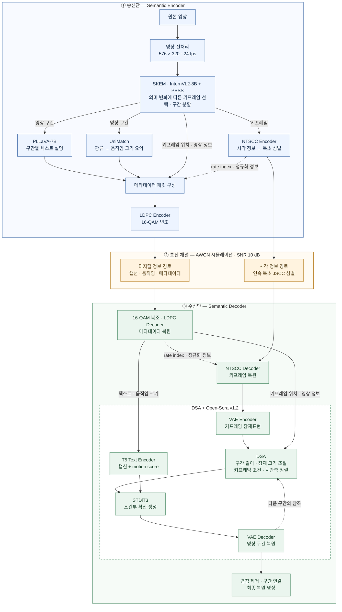

# semantic_transmission 모델 구조

현재 `semantic_transmission`의 ETRI 실행 설정인 **SKEM + DSA 구조**입니다.
송신단에서 의미 정보를 추출하고, 두 전송 경로를 거쳐 수신단에서 영상을 생성합니다.

*그림 1. 현재 구현된 LGVSC 기반 영상 의미 통신 시스템. 점선은 복호 보조정보 전달과 구간 간 참조를 나타냅니다.*

- **송신 데이터:** 키프레임의 NTSCC 심벌과 캡션·움직임 크기·복원에 필요한 메타데이터입니다.
- **움직임 표현:** UniMatch 광류를 **구간당 스칼라 하나**로 요약하고, 수신단에서 `motion score`라는 텍스트 조건으로 사용합니다.
- **DSA의 역할:** 구간마다 생성 길이와 키프레임 조건을 정렬하고, 이전 생성 구간을 참조하도록 구성합니다.

구현 근거: [실행 설정](../configs/etri_official.json),
[송수신 코드](../src/semantic_transmission/codec_transport.py),
[생성 디코더](../04_semantic_decoder/scripts/mydemo_new_align_sh.py).
