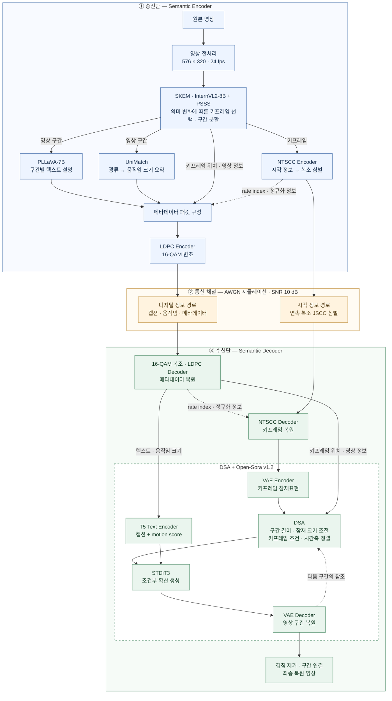

# semantic_transmission 모델 구조

현재 `semantic_transmission`의 ETRI 실행 설정인 **SKEM + DSA 구조**입니다.
송신단에서 의미 정보를 추출하고, 두 전송 경로를 거쳐 수신단에서 영상을 생성합니다.

*그림 1. 현재 구현된 LGVSC 기반 영상 의미 통신 시스템. 점선은 복호 보조정보 전달과 구간 간 참조를 나타냅니다.*

- **송신 데이터:** 키프레임의 NTSCC 심벌과 캡션·움직임 크기·복원에 필요한 메타데이터입니다.
- **움직임 표현:** UniMatch 광류를 **구간당 스칼라 하나**로 요약하고, 수신단에서 `motion score`라는 텍스트 조건으로 사용합니다.
- **DSA의 역할:** 구간마다 생성 길이와 키프레임 조건을 정렬하고, 이전 생성 구간을 참조하도록 구성합니다.

구현 근거: [실행 설정](../configs/etri_official.json),
[송수신 코드](../src/semantic_transmission/codec_transport.py),
[생성 디코더](../04_semantic_decoder/scripts/mydemo_new_align_sh.py).

## 후속 요구와 현재 구조의 구분 — 2026-09-21

앞으로의 개발 기준은 [ETRI 후속 메일](ETRI_FOLLOWUP_EMAIL_SUMMARY.md)과
[개발 계획](ETRI_DEVELOPMENT_PLAN.md)이다. 위 그림은 현재 추론 경로를 나타낸다.
장시간 3유형 평가, 오류 영역 표시, 씬 체인지 누락 대안이 모두 구현됐다는 뜻은 아니다.
그림의 10 dB는 기존 실행 설정이며 메일에서 지정한 유일한 SNR은 아니다.

- **중간 구간 정보:** PLLaVA 구간 캡션이 이미 있다. 공식 경로는 구간에서 네 프레임을 표집하므로
  모든 중간 프레임의 동작·관계를 설명하는 것은 아니다. “키프레임만 보고 캡션이 전혀 없다”로 설명하지 않는다.
- **움직임 한계:** 구간당 광류 스칼라 하나는 객체별 속도·방향·등장/퇴장 시각을 명시적으로 전달하는
  표현이 아니다. 걷기·달리기·정지 준비 구분과 중간 caption/video summary 보강은 별도 검증 대상이다.
- **장면 경계:** SKEM의 의미 변화 기반 선택만으로 씬 체인지 검출 성능을 보장하지 않는다.
  경계 누락·지연, Keyframe·Semantic Packet 갱신, 이전 장면의 캡션·생성 참조 초기화를 따로 검증한다.
- **후속 설계:** 최대 키프레임 간격·주기적 의미정보 갱신 등의 누락 대안, 동적 정보 보강과
  수신 근거 기반 검출·완화를 비교한다. 실제 구현과 효과는 별도 기록으로 확인해야 한다.

## 학습 데이터 설명의 단위

이미지 코덱, 영상 생성기, 의미 추출기의 사전학습과 이 프로젝트의 추가 학습을 구분한다.
아래는 로컬 코드·기존 감사에서 확인할 수 있는 범위와 앞으로 보완할 근거다.

| 모듈 | 현재 확인 범위 | 후속 설명에 필요한 근거 |
| --- | --- | --- |
| NTSCC | 공개 quality-4 이미지 코덱 가중치를 사용한다. 기존 감사상 공개 설명의 OpenImages 50만 이미지와 논문의 10만 프레임 학습은 동일성이 미확인이다. | 실제 가중치 해시·학습 이력·논문 가중치와의 관계 |
| InternVL2·PLLaVA | 사전학습 체크포인트로 키프레임 선택·구간 캡션을 추론한다. PLLaVA LoRA 로딩 자체는 로컬 추가 학습의 증거가 아니다. | 체크포인트별 이미지/동영상 학습 자료·목적과 시간축 표현 범위 |
| UniMatch | 사전학습 광류 모델을 추론하고 움직임 스칼라로 요약한다. | 광류 모델 학습 자료와 실제 전달 표현이 보존하는 정보의 차이 |
| Open-Sora STDiT·VAE·T5 | 고정된 사전학습 구성으로 영상 구간을 생성한다. NTSCC의 이미지 학습 설명을 이 구성 전체에 적용할 수 없다. | 구성 요소별 모델 문서·영상 학습 이력·사용 체크포인트와의 대응 |
| 프로젝트 추가 학습 | 기존 정렬·키프레임 추가·품질 보정 문서는 무학습 변경으로 기록돼 있다. | 후속 동영상 미세조정의 필요성·데이터·계산량 검토. 실행 시 별도 학습 로그·가중치 이력 |

체크포인트 식별자는 [모델 설정](../configs/models.json), NTSCC 이력의 한계는
[논문·구현 감사](LGVSC_PAPER_IMPLEMENTATION_AUDIT.md), 확보한 이미지 자료는
[로컬 데이터셋](LOCAL_DATASETS.md)에 있다. 데이터 확보·모델 로딩·추론 성공만으로
학습 완료나 시간축 신뢰성을 주장하지 않는다. 메일에 대한 모듈별 학습 근거 정리는 후속 작업이다.
