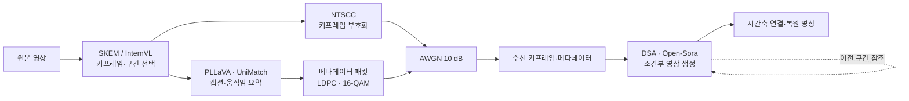

# 모델 구조와 구현 범위

갱신: **2026-09-28**. [과제 현황](README.md) · [개발·평가 기준](ETRI_DEVELOPMENT_PLAN.md)
LGVSC의 SKEM 키프레임 선택과 DSA 가변 길이 생성을 기반으로 한다. 개발 영상 한 편의 60초 복원을 완료했다.

## 처리 흐름

```mermaid
flowchart LR
    A[원본 영상] --> B["SKEM / InternVL<br/>키프레임·구간 선택"]
    B --> C["NTSCC<br/>키프레임 부호화"]
    B --> D["PLLaVA · UniMatch<br/>캡션·움직임 요약"]
    D --> E["메타데이터 패킷<br/>LDPC · 16-QAM"]
    C --> F[AWGN 10 dB]
    E --> F
    F --> G[수신 키프레임·메타데이터]
    G --> H["DSA · Open-Sora<br/>조건부 영상 생성"]
    H --> I[시간축 연결·복원 영상]
    H -. 이전 구간 참조 .-> H
```

| 부분 | 실제 역할 | 현재 한계 |
|---|---|---|
| SKEM / InternVL2-8B | 최근 키프레임과 후보의 설명·PSSS 점수로 선택; 기준 threshold 0.35 | 큰 계산 비용, 씬 검출 성능을 별도로 검증해야 함 |
| PLLaVA-7B | 구간의 네 표본 프레임으로 캡션 생성 | 짧은 객체·동작·시각 누락 가능 |
| UniMatch | 광류를 구간당 움직임 스칼라 하나로 요약 | 객체별 속도·방향·등장/퇴장을 명시하지 않음 |
| NTSCC | 키프레임을 연속 복소 심벌로 부호화·AWGN 송수신 | 손실 복원, 공개 quality-4 고정 체크포인트 |
| 디지털 패킷 | 캡션·광류·위치·rate index·정규화·설정을 LDPC/16-QAM으로 전달 | 메타데이터 무오류가 설명의 의미 정확도를 보장하지 않음 |
| DSA / Open-Sora | 구간 길이·잠재 크기와 조건을 구성해 STDiT·VAE로 영상 생성 | 중간 프레임 형태·동작 오류와 이전 생성 오류의 전달 |

Semantic Packet은 현재 전송되는 의미·보조정보 묶음이다. `scene_id`·유효범위·갱신 사유를 가진 완전한 씬 갱신 기능이
이미 검증됐다는 뜻은 아니다. 캡션이 존재해도 동적 정보가 충분한지는 별도다.

## 구현을 찾는 위치

| 위치 | 역할 |
|---|---|
| [workers.py](../src/semantic_transmission/workers.py) | 전처리·선택·캡션·광류 단계 연결 |
| [SKEM](../02_semantic_encoder/skem/MLM-keyframe-internvl.py) | InternVL 비교·선택·체크포인트 |
| [codec_transport.py](../src/semantic_transmission/codec_transport.py) | NTSCC·패킷·채널·전송량 |
| [생성기](../04_semantic_decoder/scripts/mydemo_new_align_sh.py) | DSA·조건 주입·이전 참조·생성 |
| [temporal.py](../src/semantic_transmission/temporal.py) | 공유 경계 제거·시간축 연결 |
| [etri_60s.py](../src/semantic_transmission/etri_60s.py) | 길이 보존·단계 재개·전체 복원 검사 |
| [official_quality.py](../src/semantic_transmission/official_quality.py) | PSNR·SSIM·LPIPS·CLIP·DISTS |
| [모델 설정](../configs/models.json) · [공식 프로필](../configs/etri_official.json) | 모델 ID·기존 실행 조건 |

60초 실행은 별도 프로필이다. 기본 10초·16초 설정의 `max_frames`를 그대로 장시간 실행이라고 부르지 않는다.
구간 클립은 프레임 기준으로 추출·검사하고 캡션을 구간별 저장한다. 생성 출력은 CPU에 보관하며 참조에 필요할 때 GPU로 옮긴다.
[실행 조건·재개 범위](RUN_GUIDE.md#long-video)

## 논문·공개 코드·로컬 변경을 구분하기

- **알고리즘 대응:** SKEM/PSSS, 구간 캡션·광류, NTSCC, DSA는 논문·공개 구현의 주요 구성과 대응한다.
- **가중치 이력:** NTSCC 공개 설명의 OpenImages 50만 이미지와 논문의 10만 프레임 학습은 동일성이 미확인이다.
  현재 로더는 quality-4 고정 가중치를 사용한다. 논문 실험 가중치 전체 재현을 주장하지 않는다.
- **연결과 조건 정렬:** 공개 연결은 입력 F장·키프레임 K개에서 `F + K − 2`장이 될 수 있다.
  `concatenation_policy=endpoint_exact`는 경계 중복을 없앤다. 생성 조건 위치·참조 길이를 바꾸는 것과 별개다.
- **VAE 시간축:** 17 영상 프레임/5 잠재 프레임 블록과 나머지 처리 때문에 잠재 인덱스 정렬만으로 픽셀 끝점 정확성을 보장하지 않는다.
  반올림 해제·참조 길이·결합 비교는 부분 개선과 새 왜곡을 보여 기본값 채택을 보류했다.
- **전송량:** 시각+디지털 메타데이터 실제 채널 사용량을 계측한다. 논문의 side information 근사나 모든 물리 링크 비용과 같지 않다.
- **이식 범위:** CPU offload·환경 분리·재사용은 16GB GPU 실행을 위한 변경이다. 논문 전체 데이터셋·SNR·downstream 재현은 미완료다.

[최신 조건 실험](ETRI_COMBINED_REFERENCE_DIAGNOSIS.md#decoder) ·
[9월 18일 감사 원문·검증 근거](https://github.com/SangukBae/semantic_transmission/blob/f41bc8885e8d8409e59b162fe7be63c0d11ee737/docs/LGVSC_PAPER_IMPLEMENTATION_AUDIT.md)

## 학습 이력과 남은 확인

| 모듈 | 확인 범위 | 보완할 근거 |
|---|---|---|
| NTSCC | 공개 이미지 코덱 가중치 사용 | 논문 가중치와의 관계·해시·학습 이력 |
| InternVL2·PLLaVA | 고정 사전학습 모델로 추론 | 체크포인트별 이미지/영상 자료·시간축 학습 목적 |
| UniMatch | 사전학습 광류 추론 | 학습 자료와 스칼라 요약에서 잃는 정보 |
| Open-Sora STDiT·VAE·T5 | 고정 사전학습 구성으로 영상 생성 | 구성별 영상 학습 이력·사용 가중치 대응 |
| 로컬 추가 학습 | 현재 비교는 무학습 조건 변경 | 재학습 필요성·자료·계산량; 실제 착수 시 로그·가중치 이력 |

PLLaVA LoRA 로딩이나 이미지 데이터 보유 자체는 로컬 추가 학습의 증거가 아니다.
씬 경계 누락·패킷 갱신·참조 초기화와 동적 정보 보강은 효과 검증이 남았다.

세부 코드 설명과 원본 단계별 설명은 [코드 해설 원문](https://github.com/SangukBae/semantic_transmission/blob/f41bc8885e8d8409e59b162fe7be63c0d11ee737/docs/CODE_WALKTHROUGH.md),
[공개 파이프라인 설명](https://github.com/SangukBae/semantic_transmission/blob/f41bc8885e8d8409e59b162fe7be63c0d11ee737/docs/pipeline.md),
[재현성 원문](https://github.com/SangukBae/semantic_transmission/blob/f41bc8885e8d8409e59b162fe7be63c0d11ee737/docs/REPRODUCIBILITY.md)에 보존한다.
