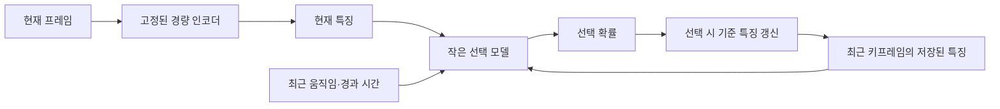

# LGVSC 학습 기반 키프레임 선택기 검토안

작성일: 2026-09-21. 사용자가 제안한 **프레임 특징 기반 키프레임 선택 학습**과 관련 논문, 적용 방향을 정리한 문서다. 현재는 설계 제안이며, 선택기 구현·학습·속도 향상·복원 품질 유지가 검증된 상태는 아니다.

**첫 검증 후보는 ‘고정된 경량 인코더 + 최근 키프레임을 고려하는 작은 선택 모델 + 기존 SKEM 모방 학습’이다.**

관련 문서: [ETRI 요구사항](../ETRI_FOLLOWUP_EMAIL_SUMMARY.md) · [기존 단기 실험안](ETRI_LGVSC_HALLUCINATION_EXPERIMENT_PLAN_2026-09-21.md) · [현재 코드 감사](ETRI_HALLUCINATION_CODE_AUDIT_2026-09-21.md).

## 1. 목적과 현재 SKEM의 차이

현재 SKEM은 최근 키프레임과 후보 프레임을 InternVL에 함께 입력한다. 두 이미지의 설명을 생성한 뒤 같은 장면인지 다시 질문하고, `P(No) - P(Yes) > 0.35`이면 후보를 선택한다. 후보마다 두 차례 언어 생성이 수행되며, 기준 키프레임이 같아도 설명은 다시 생성한다. [현재 구현](../../02_semantic_encoder/skem/MLM-keyframe-internvl.py)

제안 방식은 이 판단을 **경량 인코더의 특징 추출과 작은 모델의 선택 점수 예측**으로 대체한다. 각 프레임의 특징을 한 번 계산해 저장하고 재사용하므로 선택 단계의 계산을 줄일 가능성이 있다. 학습 비용과 실제 전체 처리 시간은 별도로 측정해야 한다.

## 2. 현재 프레임과 최근 키프레임을 함께 보는 구조

**현재 프레임의 특징과, 마지막으로 키프레임으로 선택한 프레임의 특징을 선택 모델에 함께 입력한다.** 최근 키프레임은 매번 바로 전 프레임이 되는 것이 아니라, 새로운 키프레임이 선택될 때 갱신된다.

모델이 배울 질문은 다음과 같다.

> 현재 프레임에, 최근 키프레임만으로는 전달하기 어려운 새로운 정보가 있는가?

입력은 현재 특징 `z_t`, 최근 키프레임 특징 `z_k`, 두 특징의 차이, 최근 프레임 간 변화, 마지막 선택 후 경과 시간으로 구성할 수 있다. 선택 모델은 작은 MLP나 GRU부터 검토한다. 특징은 송신단의 선택 판단에 사용하며, 이 설계 자체가 특징 벡터의 추가 전송을 요구하지는 않는다.

사람이 이동하는 영상의 **개념 설명용 예시**는 다음과 같다. 실제 모델 출력이나 검증 결과는 아니다.

| 프레임 | 모습 | 선택 판단 예시 |
|---|---|---|
| 0번 | 사람이 화면 왼쪽에 있음 | 첫 키프레임으로 선택하고 특징 저장 |
| 1번 | 위치가 거의 그대로 | 0번과 비교해 생략. 기준은 계속 0번 |
| 2번 | 사람이 화면 오른쪽으로 이동 | 0번과 비교해 선택. 기준 특징을 2번으로 갱신 |
| 3번 | 오른쪽에 그대로 있음 | 2번과 비교해 추가 선택 여부 판단 |

동일한 프레임도 이미 선택한 키프레임에 따라 추가 전송 가치가 달라진다. 이 관계를 입력하면 비슷한 장면의 중복 선택을 줄이면서 새로운 변화를 판단하도록 학습할 수 있다.

## 3. 관련 논문 네 편

| 논문 | 핵심 방법 | LGVSC 적용 시 참고점과 차이 |
|---|---|---|
| **[FCSN: Video Summarization Using Fully Convolutional Sequence Networks](https://arxiv.org/html/1805.10538)** — ECCV 2018 | 사전학습 CNN의 프레임 특징을 입력받아 시간축 1D CNN으로 프레임별 선택 여부를 예측 | 제안한 ‘특징 추출 → 선택 학습’ 구조와 직접적으로 유사. 학습 목표는 영상 요약이며 LGVSC 복원 품질을 보장하지 않음 |
| **[DR-DSN: Deep Reinforcement Learning for Unsupervised Video Summarization with Diversity-Representativeness Reward](https://ojs.aaai.org/index.php/AAAI/article/view/12255)** — AAAI 2018 | 프레임별 선택 확률을 예측하고, 다양성과 대표성 보상으로 강화학습 | 정답 키프레임 없이 선택기를 학습하는 사례. 해당 보상만으로 객체·동작 복원 오류가 최소화되지는 않음 |
| **[SUM-GAN: Unsupervised Video Summarization with Adversarial LSTM Networks](https://openaccess.thecvf.com/content_cvpr_2017/papers/Mahasseni_Unsupervised_Video_Summarization_CVPR_2017_paper.pdf)** — CVPR 2017 | 선택한 프레임으로 원본의 특징 시퀀스를 재구성하도록 적대적 학습 | 원본 정보의 복원 가능성을 선택 기준에 반영하는 참고 사례. 특징 재구성과 실제 픽셀 영상 복원은 구분해야 함 |
| **[VQ-DeepVSC: A Dual-Stage Vector Quantization Framework for Video Semantic Communication](https://arxiv.org/html/2409.03393v1)** — 2024 프리프린트 | 주변 프레임으로 보간한 결과의 복원 오차를 중요도로 사용하고, 채널 조건에 따라 선택량을 결정 | 전송 후 전체 영상을 복원한다는 목적이 가까움. 특징 기반 이진 선택기를 직접 학습하는 구조와는 차이가 있음 |

**구조 설계는 FCSN, 복원 관점의 선택 기준은 VQ-DeepVSC부터 참고한다.** 위 논문들은 관련 설계의 근거이며, LGVSC에 이식했을 때의 효과를 입증한 자료는 아니다.

## 4. RTX 4080에서 시작할 학습 방법

1. **원본 영상 단위로 학습·개발·평가 자료를 분리한다.** 같은 영상의 인접 프레임을 학습과 평가에 나누어 넣지 않는다.
2. **사전학습 인코더를 고정하고 특징을 미리 추출한다.** 작은 선택 모델만 학습해 학습 중 GPU 메모리와 반복 특징 추출 비용을 줄인다. 추론 시간에는 특징 추출 비용도 포함한다.
3. **기존 SKEM의 선택 결과와 PSSS 점수로 모방 학습한다.** 최근 키프레임과 후보의 쌍을 학습 입력으로 구성한다. 기존 로그를 우선 활용하되, 학습 자료가 부족하면 추가 교사 추론 비용이 발생한다. PSSS 점수는 회귀 대상으로, 선택 여부는 분류 대상으로 사용할 수 있다.
4. **개발 영상에서 정책을 고정한다.** 선택 임계값과 첫·마지막 프레임 보장, 최대 키프레임 간격 등의 규칙을 정한다. 학생 모델의 출력 척도에 맞춰 임계값을 정하며 기존 PSSS 임계값을 자동으로 재사용하지 않는다.
5. **별도 평가 영상에서 실제 LGVSC로 복원한다.** 기존 선택기와 학습 선택기의 전체 처리 시간·전송량·복원 품질을 비교한다.

처음에는 Open-Sora 복원을 매 학습 단계마다 실행하는 강화학습보다, 저장된 특징과 교사 판단으로 작은 선택기를 학습하는 안을 우선한다. LGVSC 복원은 후보의 효과를 확인하는 평가 단계에 사용한다. 실제 학습 시간과 메모리 사용량은 아직 측정하지 않았다.

## 5. 학습 정답과 검증에서 주의할 점

**LGVSC의 목표는 ‘이 프레임을 보내지 않으면 복원에서 객체·동작이 잘못되는가?’를 판단하는 것이다.** TVSum의 기존 중요도 주석은 사람이 보기 좋은 요약을 위한 점수이므로, 복원에 필요한 키프레임의 정답으로 그대로 취급하지 않는다. 잠깐 등장한 작은 객체는 요약에서 생략될 수 있지만 ETRI 평가에서는 Missing 오류가 될 수 있다.

- **모방 학습의 범위:** 초기 목표는 기존 SKEM 판단을 저비용으로 근사하는 것이다. 교사의 선택 오류도 학습할 수 있으므로 모방 정확도 상승을 복원 품질 개선으로 해석하지 않는다.
- **순차 선택의 영향:** 학생이 교사와 다른 키프레임을 선택하면 이후 비교 기준도 바뀐다. 고정된 프레임 쌍의 정확도와 실제 순차 선택 결과를 함께 확인한다.
- **비용 비교:** 같은 전송 예산에서 선택 품질을 비교한다. 키프레임 수가 같아도 내용·구간 분할에 따라 전송량과 caption·복원 계산이 달라질 수 있으므로 실제 비용을 기록한다.
- **최종 평가:** Added/Missing/Distorted의 발생 구간과 새 오류, PSNR·SSIM·LPIPS, 입력부터 복원까지의 전체 시간을 확인한다. 속도 향상과 품질 유지가 함께 확인돼야 채택한다.

이 문서는 두 주석의 아이디어와 관련 문헌을 정리한 검토안이다. 기존 단기 실험안의 우선순위 변경이나 새 선택기의 채택·구현·학습 완료를 뜻하지 않는다.
